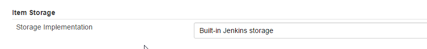
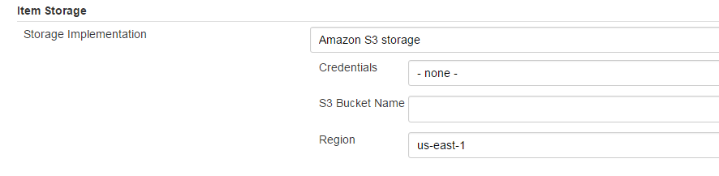
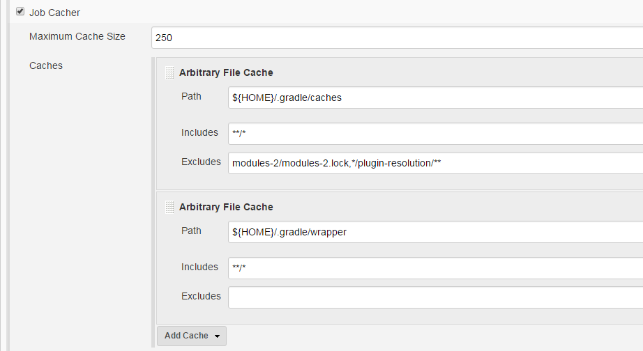

# Job Cacher Plugin

[](https://ci.jenkins.io/job/Plugins/job/jobcacher-plugin/job/master/)
[](https://plugins.jenkins.io/jobcacher)
[](https://plugins.jenkins.io/jobcacher)

This plugin was created to improve build performance for builds that utilize executors that start from a clean
image each time such as docker based executors.  This plugin was inspired by the caching capability of TravisCI.

## Features

- Item storage extension point supporting on master storage and AWS S3
- Cache Wrapper for free style jobs that manages the cache
- Arbitrary File Cache where user specifies paths to be cached
- UI on Job page to review the job's caches
- Supports Pipeline jobs with a cache block
- Cache Extension Point for other plugins to provide opinionated caching capability such as Gradle caches

## Global Configuration

By default, the plugin is configured to use on-master storage for the
cache.



This storage mechanism is not recommended for heavy use as it will
burden the remoting channel with considerable data when the job starts.

In addition to the on-master storage, a storage implementation for
Amazon S3 is also available.



Additional storage implementations can be contributed as well via the
*ItemStorage* extension point.

## Job Configuration

The plugin offers a Build Wrapper extension point that can be configured
for use in Free Style jobs. Prior to the build starting, the plugin
checks if there is a populated cache and if so copies it from the
storage area to the executor. At the end of the build, the plugin then
copies the same cache, incrementally, back to storage.



The above configuration caches the gradle cache and wrapper so that
subsequent builds don't need to rebuild these folders and files through
the dependency management repository. It also configures the cache to
have a maximum size of 250 MB so that the cache won't grow indefinitely.
Once this size is hit, the cache is deleted in the storage and the next
build will need to repopulate the cache from scratch.

## Pipeline Configuration

The plugin also supports the Pipeline plugin by introducing a cache
build step that can be used within the pipeline definition. 

``` syntaxhighlighter-pre
 cache(maxCacheSize: 250, caches: [
     [$class: 'ArbitraryFileCache', excludes: 'modules-2/modules-2.lock,*/plugin-resolution/**', includes: '**/*', path: '${HOME}/.gradle/caches'],
     [$class: 'ArbitraryFileCache', excludes: '', includes: '**/*', path: '${HOME}/.gradle/wrapper']
  ]) {
  // some block
}
```

## Cache Types

The plugin currently ships with a single cache implementation called
*ArbitraryFileCache*which must be explicitly configured with a path and
includes / excludes rules to apply to find the files to cache. Since
*Cache* is an extension point in the plugin, other plugins can
contribute implementations that deliver specific behavior such as a
*GradleCache* that could automatically look to cache all gradle related
files that can be cached from build to build.

## Visualizing the Cache

A job action is added to the job so that users can look at the contents
of the cache.

Currently for on master storage, this is visualized through the Jenkins
interface and for Amazon S3 storage, this redirects the user to the S3
console to view the cache contents.

## Contributing

See [contribution guidelines](https://github.com/jenkinsci/.github/blob/master/CONTRIBUTING.md)

## Changelog

See [releases](https://github.com/jenkinsci/pipeline-project-env-plugin/releases)